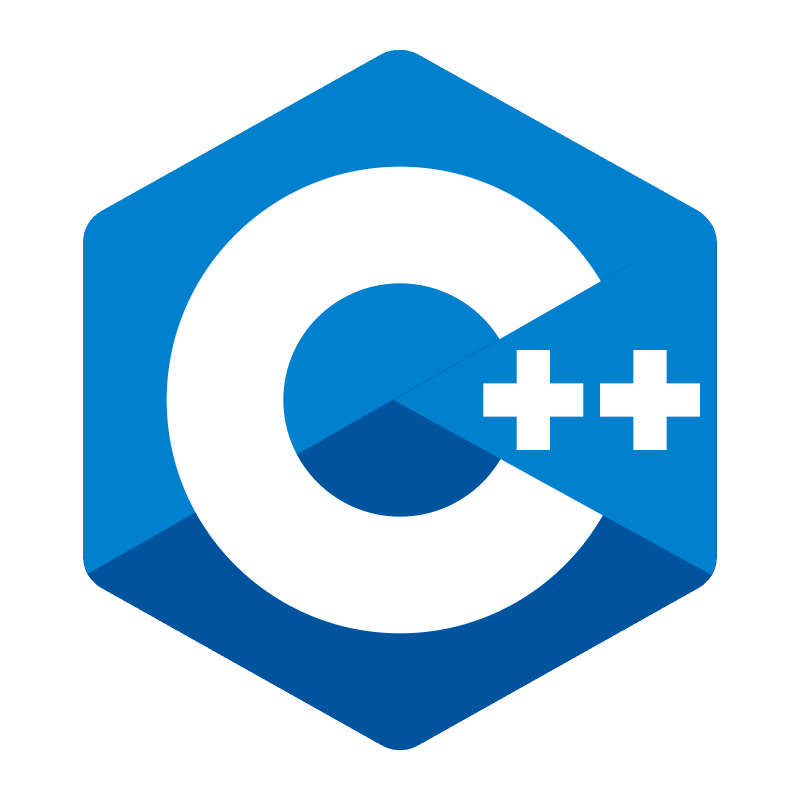
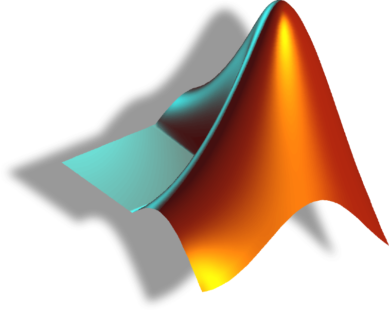
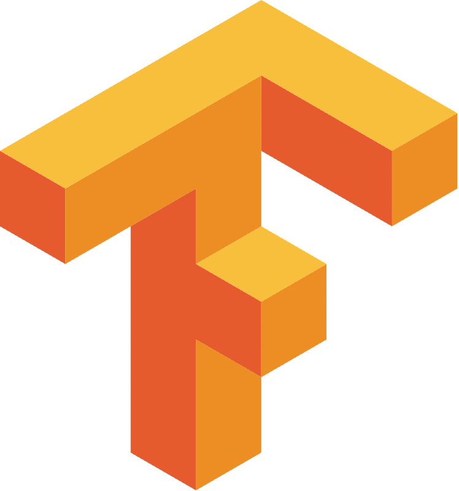

# Truong Nguyen

<link href="assets/icons/favicon.png" rel="icon">
<link href="assets/icons/apple-touch-icon.png" rel="apple-touch-icon">  
<link rel="stylesheet" href="https://cdnjs.cloudflare.com/ajax/libs/font-awesome/6.4.0/css/all.min.css">
<link rel="stylesheet" href="style.css">

## About

### About Me

I am a passionate Data Scientist and Machine Learning Engineer with a strong academic background and practical experience in various domains. My expertise lies in building and deploying machine learning solutions to solve complex business problems, improve customer experiences, and drive innovation.

I am proficient in Python, R, SQL, NoSQL, Pytorch, Scikit-Learn, OpenCV, Docker, and BigQuery, and I am eager to leverage my skills to contribute to impactful projects. My portfolio showcases my ability to deliver robust and efficient solutions across diverse domains, including retail analytics, healthcare, computer vision, and natural language processing. I am a collaborative team player with a keen eye for detail, driven to deliver high-quality results that exceed expectations.

## Skills

### Programming Languages

-  Python
-  C++
-  R
-  SQL
-  MATLAB

### Frameworks & Clouds

-  Pytorch
-  TensorFlow
-  HuggingFace
-  OpenCV
-  Sklearn
-  AWS
-  GCP

## Experience

### Data Scientist
**Northumbria University, UK**  
*Jan 2023 - Jun 2023*

- Extracted data from medical wearable devices, transformed sensory data into tabular datasets, and visualized users' behavior patterns.
- Utilized statistical analysis to assess the effectiveness of medical wearable devices for drooling treatment for People with Parkinson's Disease.
- Developed a Machine Learning model to build a personalized treatment schedule recommendation system, predicting treatment hours for individuals with Parkinson's Disease.

### Machine Learning Engineer
**Seedcom - A Venture Capital Company, Vietnam**  
*Nov. 2020 - Present*

#### Recipe Recommendation System
- Leveraged Vietnamese recipe blogs to curate product bundles, creating targeted promotions that align with popular recipes and culinary trends.
- Developed a recommendation system that suggests complementary products based on user shopping baskets and associated recipes, driving cross-sales and enhancing the customer shopping experience.

#### Product Price Mapping with Competitors
- Developed and implemented a web scraping system to collect product data from competitor websites. Utilized a multimodal model to accurately map competitor products to the company's product catalog.
- Established a robust pipeline for continuous monitoring and comparison of online pricing between the company's products and competitors, ensuring up-to-date pricing intelligence.
- Integrated price tracking data into product analytics dashboards, enabling real-time visibility and actionable insights for pricing strategies and competitive analysis.

#### Product and Combo Pricing
- Conducted thorough statistical analysis to identify top-performing product combinations frequently bought together, optimizing cross-sell opportunities.
- Developed and implemented a dynamic pricing algorithm for product bundles, ensuring competitive pricing that maximizes both customer retention and profit margins.
- Designed a comprehensive 1-year promotional strategy for product bundles, incorporating special pricing to boost sales and enhance customer engagement.

#### Sales Forecast and Inventory Management
- Conducted comprehensive statistical analysis to identify trends and seasonal patterns in time-series sales data, providing actionable insights for decision-making.
- Deployed sophisticated forecasting models, including DeepAR and LightGBM, to predict sales at the store and area levels with high accuracy.
- Enhanced inventory management by implementing an alert system to identify and address overstock and understock situations, thereby optimizing stock levels and reducing carrying costs.

#### Style Improvement Recommendation Systems
- Led a team of 3 engineers, researched, proposed, implemented, and deployed a computer vision solution.
- Utilized RetinaNet and OpenCV to build a fashion items object detection and localization system to identify what users are wearing with an average precision of 92%.
- Retrieved store's similar items to what users are wearing.
- Documented and packaged models using Docker, delivered to the Recommendation team for further research by pushing Docker Image to Docker Hub private repository.
- Packaged as APIs and delivered to the Recommendation team for further research.
- Built fashion items recommendation and outfit recommendation systems to improve customer's shopping experiences and targeting to increase customer click-rate, cross-sell, and total selling revenue.
- Deployed models in the form of Application Programming Interfaces (APIs) for store and web access.

#### Retail Data Analytic and Marketing Platform
- Worked as a team member in a team of 7: Project Manager, Product Design, Business Analyst, Data Engineer, Data Analyst.
- Created dashboards for analyzing, clustering, identifying trends of customers, and products of Vietnam's biggest supermarket chain using customer transaction data and product information.
- Optimized the query time for Analytic Dashboards.
- Created a well-organized documentation with definitions, formulas, and SQL codes for each section of customer and product analysis dashboards.
- Merged subsidiary database systems for a more general view.

### Machine Learning Engineer
**Vulcan Labs - Gaming and Application Company**  
*Jul. 2020 - Nov. 2020*

#### Improve Styling Camera Application
- Deployed Deep Learning and Computer Vision Solutions to AWS EC2 using Docker.
- Researched topics: Generative Adversarial Networks, Salient Object Detection, Image Segmentation.
- Researched models: StyleGAN, StyleGAN2, U-Squared-Net.

### Machine Learning Engineer
**Emage Development Pte. Ltd. - Computer Vision Company**  
*Jul. 2019 - Jul. 2020*

#### Defective Semiconductor Detection using Machine Learning
- Worked with 2 Engineers: Senior Computer Vision Engineer, Junior AI Engineer.
- Utilized OpenCV and Image Processing techniques: Hough transform, Canny edges detection, and Resnet for feature extraction.
- Used Yolov3 and RetinaNet to build a defective semiconductor detector with a precision of 98%.
- Documented and deployed Machine Learning models using Docker.

#### Research on Applying Reinforcement Learning for Auto Defective Inspection
- Researched the basic definition of Reinforcement Learning and practiced examples of Double Q-Learning.
- Deployed Machine Learning models on the factory's computer with an inspection time of 0.2 sec/image.
- Built a Windows Presentation Foundation (WPF) application for semiconductor image annotation, training, inference, and evaluating Object Detection Machine Learning models.

### Embedded Software Engineer - Internship
**Robert Bosch Engineering And Business Solutions**  
*May. 2019 - Nov. 2019*

#### Renault & Nissan Interior Application for Electrical Vehicle
- Trained with multiple problems in C/C++: Parallel Programming, Application's Design Pattern.
- Developed an application used for debugging Application's User Interface.

## Projects

### DocPatientSumm: Low-Rank Adaptation (LoRA) finetune for Clinical Conversations
  
*2024*

Fine-tuned LLMs to enhance summarization of doctor-patient conversations, improving accuracy threefold. Applied low-rank adaptation techniques to significantly boost model efficiency. Set up the model for deployment on local machines and configured multi-GPU training. Implemented model parallelism to manage complex computations and large datasets effectively.

### Complaint Tweet Classification using Prompt Tuning of Large Language Models (LLMs)
  
*2024*

This project investigated the application of prompt tuning to fine-tune a Large Language Model (LLM), specifically the BLOOM model, for the task of classifying complaint tweets. Data Acquisition and Preprocessing: Collected and prepared a dataset of complaint tweets for the classification task. Prompt Tuning: Designed effective prompts to guide the LLM towards identifying sentiment and classifying complaint tweets. Fine-tuning BLOOM: Fine-tuned the BLOOM LLM using the engineered prompts for complaint tweet classification.

### RAG agent llama3
  
*2024*

Developed a retrieval-augmented generation system using Llama3 and LangGraph to improve automated question-answering capabilities. Implemented a routing function with LangGraph to classify questions and retrieve relevant documents, ensuring efficient and accurate information retrieval. Integrated a fallback mechanism to perform web searches for queries unrelated to indexed documents, enhancing the system's robustness. Added self-correction and hallucination detection features to validate generated answers, ensuring high accuracy and reliability in responses.

### Building a Q&A system using Langchain and Vicuna
  
*2024*

Implemented an advanced Question Answering system using Langchain for prompt engineering and Vicuna for fine-tuning. Enhanced system efficiency and relevance in responses by integrating document retrieval and context-aware answering capabilities. Employed prompt engineering techniques to improve system performance and reduce response time. Evaluated and fine-tuned the system using extensive testing and feedback loops to ensure high accuracy and user satisfaction.

### GEMMA: A Generalist Agent for Vision and Language Tasks
  
*2024*

Developed a versatile model, GEMMA, capable of tackling multiple vision and language tasks by leveraging a unified architecture. Combined state-of-the-art techniques in natural language processing and computer vision to create a robust generalist agent. Integrated multi-task learning approaches to enhance the model's ability to handle diverse tasks without performance degradation. Conducted extensive evaluation and fine-tuning to ensure the model's accuracy and generalization across various vision and language benchmarks.

### Analyzing and Recommending High School and University Curricula
  
*2024*

Developed an advanced system to analyze and recommend curricula for high schools and universities, optimizing educational pathways. Utilized natural language processing and machine learning techniques to analyze curriculum content and identify key areas for improvement. Implemented recommendation algorithms to suggest curriculum modifications and enhancements based on student performance data. Created a user-friendly interface for educators and administrators to interact with the system and customize recommendations.

### OCR using AWS
  
*2024*

Developed and deployed a robust Optical Character Recognition (OCR) system using AWS cloud services, enhancing document digitization processes. Leveraged AWS Textract and other cloud-native tools to build an efficient and scalable OCR pipeline. Implemented pre-processing and post-processing steps to improve the accuracy and reliability of text extraction. Deployed the system on AWS, ensuring high availability, security, and performance for large-scale OCR tasks.

## Education

### Northumbria University
*Master of Science in Data Science (with Distinction)*  
2022 - 2023

### Ho Chi Minh City University of Technology
*Bachelor of Engineering in Electrical and Electronics Engineering*  
2015 - 2020

## Awards and Recognitions

### XPrize Prompt Engineering
*Third Place*  
2023

### Google Kickstart
*Top 5%*  
2022

### Kaggle Competition Expert
*Top 1%*  
2021

## Contact

- [ GitHub](https://github.com/tnguyen-umbc)
- [ LinkedIn](https://www.linkedin.com/in/truong-nguyen/)
- [ Email](mailto:truong.nguyen@gmail.com)

